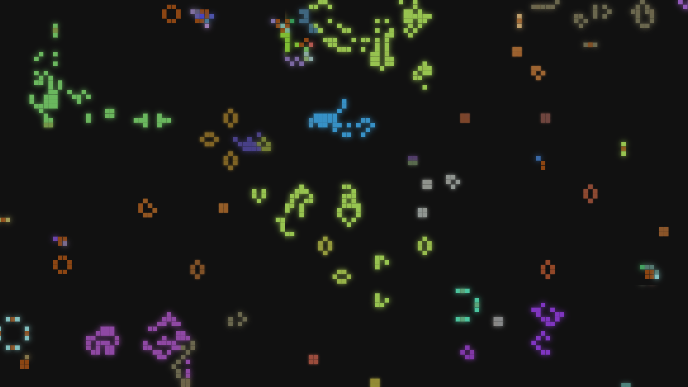

# GridLife

A web-based cellular automaton simulation inspired by Conway's Game of Life, running entirely in the browser. This project simulates a 2D ecosystem with evolving cells, rendered on an HTML Canvas.

